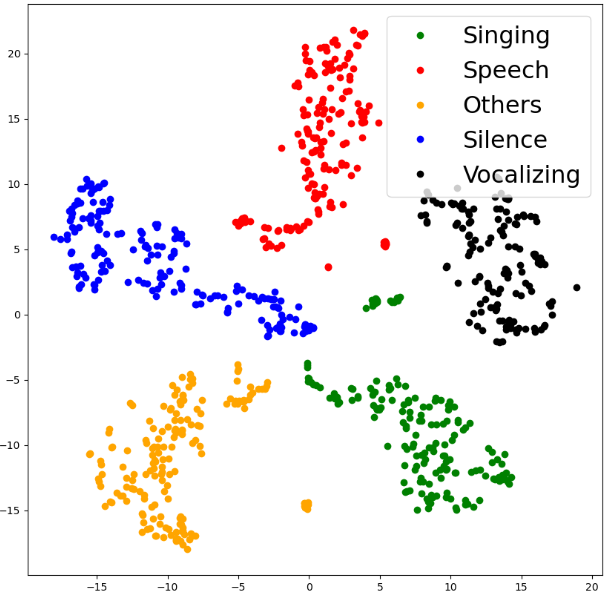

Supplementary materials for the paper: ATTENTION-BASED CROSS-MODAL FUSION FOR AUDIO-VISUAL VOICE ACTIVITY DETECTION IN MUSICAL VIDEO STREAMS

Please see here(https://yuanbo2021.github.io/Attention-based-audio-visual-VAD/) for video demos.

<h3 align="left"><a name="part3">1. The proposed attention-based AVVAD (ATT-AVVAD) framework.</a>

</h3> 

 The proposed attention-based AVVAD (ATT-AVVAD) framework consists of the audio-based module (audio branch), image-based module (visual branch), and attention-based fusion module. The audio-based module produces acoustic representation vectors for four target audio events: Silence, Speech of the anchor, Singing voice of the anchor, and Others. The image-based module aims to obtain the possibility of anchor vocalization based on facial parameters. Finally, we propose an attention-based module to fuse audio-visual information to comprehensively consider the bi-modal information to make final decisions at the audio-visual level.

<h3 align="left">2. Visualization of core representation vectors distribution after attention-based fusion from a test sample using t-SNE.

</h3> 

 The vectors in subgraph (a) are from the audio branch, vectors in subgraph (b) are from audio-visual modules after attention-based fusion.

 
<h3> Sample 1 </h3> 
<h3> Sample 2 </h3> 
<h3> Sample 3 </h3> 
<h3> Sample 4 </h3> 

<h3 align="left">3. Visualization of acoustic representation vectors and visual vocalization vector distribution from a test sample using t-SNE.

</h3> 

 The vector (black dots) representing the vocalizing of the anchor is distributed on the side representing the voices of the anchor (green dots for singing, red dots for speech).

<h3> Sample 5 </h3> 

<h3> Sample 6 </h3> 

<h3> Sample 7 </h3> 

<h3 align="left">4. For the source code, please check the Code.

</h3>

If you want to watch more intuitively, please see here: https://yuanbo2021.github.io/Attention-based-audio-visual-VAD/.

 

Please feel free to contact me if you have any questions.

Mail: Yuanbo.Hou@UGent.be

